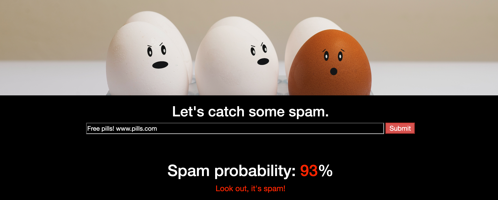

# SpamCatch


## Background
SpamCatch is a fun side project I did to bring together [NLP](https://en.wikipedia.org/wiki/Natural_language_processing), [Flask](https://flask.palletsprojects.com/en/1.1.x/), and the front-end. Classifying spam text messages is a classic machine learning problem, but I'd never seen people test their classifier on raw strings of text. After building the classifier, I connected it to a JavaScript front-end to let users input their own text, with the webpage updating with the model's predicted probability of spam.

## Table of contents
* [Python](#python)
  - [The classifier](#the-spam-classifier)
  - [Flask](#flask)
* [The front-end](#the-front-end)
  - [HTML](#html)
  - [JavaScript](#javascript)
* [Deployment](#deployment)

## How it works
### Python
#### The classifier
We start with the actual classifier, [SpamCatcher](python/spam_catcher.py). One of the key methods here is `extract_features`, which uses Scikit-learn's `TfIdfVectorizer` to convert an iterable of documents into TF-IDF values. (TF-IDF, or term frequency - inverse document frequency, is a way to categorize each term in a document by its frequency of occurrence *within the document*, while reducing the importance of terms frequent *across all documents*). If `SpamCatcher` doesn't already have a `tfidf_vectorizer` attribute, it trains one on these documents.

```python
def extract_features(self,
                     labels: pd.Series,
                     docs: pd.Series) -> pd.DataFrame:
     """| Create dataframe where each row is a document and each column
        | is a term, weighted by TF-IDF (term frequency - inverse document
        | frequency). Lowercases all words, performs lemmatization,
        | and removes stopwords and punctuation.
        |
        | ----------------------------------------------------------------
        | Parameters
        | ----------
        |  labels : pd.Series
        |    Ham/spam classification
        |
        |  docs : pd.Series
        |    Documents to extract features from
        |
        |
        | Returns
        | -------
        |  pd.DataFrame
        """
    if not self.tfidf_vectorizer:
        self.set_tfidf_vectorizer(docs)

    # Transform documents into TF-IDF features
    features = self.tfidf_vectorizer.transform(docs)

    # Reshape and add back ham/spam label
    feature_df = pd.DataFrame(features.todense(),
                              columns=self.tfidf_vectorizer.get_feature_names())
    feature_df.insert(0, 'label', labels)

    return feature_df
```

The output of this function is a dataframe where each row is a document, the first column is the ham/spam label, and the remaining several thousand columns are the TF-IDF values for each term. We use this dataframe to then train a random forest classifier. We set this classifier to `self.model`, as well as save its accuracy and most informative features for easier retrieval later.

```python
def train_model(self,
                df: pd.DataFrame) -> None:
    """
    | Train a random forest classifier on df. Assumes first column
    | is labels and all remaining columns are features. Updates
    | self.model, self.accuracy, and self.top_features
    |
    | ------------------------------------------------------------
    | Parameters
    | ----------
    |  df : pd.DataFrame
    |    The data, where first column is labels and remaining columns
    |    are features
    |
    |
    | Returns
    | -------
    |  None
    """
    X = df.iloc[:, 1:]
    y = df.iloc[:, 0]

    # Set spam as target
    y.replace({'ham': 0, 'spam': 1}, inplace=True)

    X_train, X_test, y_train, y_test = train_test_split(X, y)

    rf = RandomForestClassifier(n_estimators=100)
    rf.fit(X_train, y_train)

    self.model = rf
    self.accuracy = round(accuracy_score(rf.predict(X_test), y_test), 4)
    self.top_features = self._get_top_features(list(X_train))
    return None
```

To actually train our model, we use a CSV stored in the `static/data/` directory. This location is hard-coded as a global variable, `DATA_PATH`, at the top of the script. We also use this directory to save a pickle file of our model once it's been trained. When we instantiate our class and run `set_model`, we'll load the model if it already exists, otherwise we'll train a new one.

```python
def set_model(self,
              save_on_new: bool = True) -> None:
    """
    | Set self.model. Uses existing model at MODEL_PATH if one exists,
    | otherwise calls self.load_and_train. Model saved to MODEL_PATH
    | if save_on_new is True.
    |
    | ---------------------------------------------------------------
    | Parameters
    | ----------
    |  save_on_new : bool
    |    If self.load_and_train invoked, whether the new model should
    |    be saved to MODEL_PATH
    |
    |
    | Returns
    | -------
    |  None
    """
    if os.path.isfile(MODEL_PATH):
        logging.debug(f"Using existing model at {MODEL_PATH}")
        with open(MODEL_PATH, "rb") as input_file:
            obj = pickle.load(input_file)
            self.tfidf_vectorizer = obj['tfidf_vectorizer']
            self.model = obj['model']
            self.accuracy = obj['accuracy']
            self.top_features = obj['top_features']

    else:
        logging.debug(f"No model at {MODEL_PATH}; training new model")
        self.load_and_train()

        if save_on_new:
            logging.debug(f"Saving new model to {MODEL_PATH}")
            with open(MODEL_PATH, "wb") as output_file:
                pickle.dump(vars(self), output_file)

    return None
```

The final "main" function of this class is one that actually predicts whether a text message is spam or not. We need to first convert the string to a TF-IDF vector. It's critical that this vector has the same features our model was trained on, so we use the same `TFIDFVectorizer` instance that was used to create our training set. This is one major advantage of object-oriented programming; we can easily refer to both this original vectorizer and our random forest classifier by making them attributes of `SpamCatcher`.

```python
def classify_string(self,
                    text: str) -> float:
    """
    | Get the probability that a string is spam. Transforms the
    | string into a TF-IDF vector and then returns self.model's
    | prediction on the vector.
    |
    | ---------------------------------------------------------
    | Parameters
    | ----------
    |  text : str
    |    A raw string to be classified
    """
    if not self.tfidf_vectorizer:
        raise ValueError("Cannot generate predictions; must first "
                         " set self.tfidf_vectorizer")

    vec = self.tfidf_vectorizer.transform([text])
    return self.model.predict_proba(vec)[0][1]
```

#### Flask
Our [Flask app](app.py) is fairly simple. We begin by loading the required libraries, instantiating `SpamCatcher`, and creating our application.

```python
from flask import Flask, render_template, jsonify
from static.python import SpamCatcher

spam_catcher = SpamCatcher()
spam_catcher.set_model(save_on_new=True)

app = Flask(__name__)
```

We then define our endpoints. We'll have two endpoints that just serve HTML pages: our main page with the classifier, and a short "About" page.

```python
@app.route("/")
def index():
    return render_template("index.html")


@app.route("/about")
def about():
    return render_template("about.html")
```

For fun, I included an "inspect" endpoint, where we can actually get information about our random forest classifier, which is otherwise inaccessible to us.

```python
@app.route("/inspect")
def inspect():
    return jsonify({'top_features': spam_catcher.top_features,
                    'accuracy': spam_catcher.accuracy})
```

Finally, the main attraction: the classifier endpoint itself. I wasn't sure whether I'd be able to get away with just storing the text to classify in the URL itself - would the model get confused by spaces getting converted to `%20`, for example? It turned out to be a non-issue. For debugging, I included a `print` statement, which updates the console when serving the app locally.

```python
@app.route("/classify/<string:text>")
def classify(text):
    print(spam_catcher.classify_string(text))
    return jsonify(spam_catcher.classify_string(text))
```

And of course, we need the following code to actually start our app once we type `python app.py` in the Terminal.

```python
if __name__ == "__main__":
    app.run(debug=True)
```

### The front-end
#### HTML
Our HTML is stored in the `templates` directory, as Flask expects. We start with a header to load in D3.js, Bootstrap CSS, and our custom CSS files. We also include a `<style>` tag to specify a footer class.

```html
<!DOCTYPE html>
<html>
<head>
    <meta charset="UTF-8">
    <title>SpamCatch: Let's catch some spam</title>
    <script src="https://d3js.org/d3.v5.min.js"></script>
    <link rel="stylesheet" href="https://maxcdn.bootstrapcdn.com/bootstrap/3.3.7/css/bootstrap.min.css">
    <link rel="stylesheet" href="../static/css/reset.css">
    <link rel="stylesheet" href="../static/css/styles.css">
</head>
```

This simple styling gives us the black background with white text.

```html
<body style="background-color: black; color: white">
```

This `<div>` is our background image. I found it easier to have a CSS class with the image as the background rather than inserting the image with `` tags.

```html
<div class="hero text-center"></div>
```

The CSS for this class, in [styles.css](static/css/styles.css):

```css
.hero {
    position: relative;
    height: 240px;
    padding: 1px;
    margin-top: -2px;
    margin-left: -10px;
    background: black;
        background-attachment: scroll;
        /* image source: https://www.wsj.com/articles/getting-attacked-by-robotexts-heres-what-to-do-11566385200 */
        background-image: url("../images/spam.png");
        background-size: auto;
        background-size: cover;
}
```

After a header to get us pumped up, we have an input field to type in the spam message, with a placeholder to guide the user. Hitting enter (or even clicking outside the box) will trigger the JavaScript event handler (which we'll cover in a moment), but we also add a button for clarity.

```html
<div class="text-center">
    <h1 style="color:white">Let's catch some spam.</h1>
<input id="text" size="100" placeholder="Type a text message here"
 style="background-color: black; color: white; border-color: black; font-size:16px">
 <button id="button" type="button" class="btn-danger" style="font-size:17px">Submit</button>
</div>
```

We then have two elements that are empty at loading but will be updated with the model output once a user submits a message.

```html
<h1 id="spamProb" class="text-center spamProb"></h1>
<div id="decision" class="text-center" style="font-size: 20px"></div>
```

Finally, we have our footer with a link to the `/about` endpoint, as well as our JavaScript script that will make our page dynamic.

```html
<div class="footer">
<a href="/about" style="color:orange">More info</a>
</div>

</body>

<script src="../static/js/script.js"></script>
</html>
```

#### JavaScript
We start by defining strings that we'll reference or modify later. `SPAM_API` is our classifier endpoint, while the following templates are the HTML we'll use for any probability returned by the endpoint. We use our custom `String.format` function to fill the `{0}` and `{1}` placeholders with inputted arguments; it's apparently taboo to modify built-in classes in JavaScript, but I was craving something analogous to Python's convenient string templating.

```javascript
const SPAM_API = "/classify"
var spamProbTemplate = `Spam probability: <span style="color: {0}">{1}</span><span style="color:white">%</span>`;
var decisionTemplate = `<span style="color: {0}">{1}</span>`;
```

We then have our event handlers. The first function, `onSubmit`, gets the value of the input text field, logs it to the console, and passes it to `updateSpamProb`.

```javascript
function onSubmit() {
    var text = d3.select("#text").property("value");
    console.log(text);
    updateSpamProb(text);
}
```

`updateSpamProb` then selects the (formerly empty) div whose ID is `spamProb`. It fills the URL with the text from the input field, then uses D3 to perform a `GET` request to our `classify` Flask endpoint. Our endpoint returns a probability of spam, which we convert to a HEX color with `prob2color`. We then format our `spamProbTemplate` with the color and spam probability (converted to a rounded percentage), and assign this to the div's HTML. We then use `updateDecision` to update the `decisionTemplate` with the corresponding message and color.

```javascript
function updateSpamProb(value) {
    var div = d3.select("#spamProb");
    var url = `${SPAM_API}/${value}`;

    d3.json(url).then(prob => {
         var color = prob2color((1-prob));
         div.html(String.format(spamProbTemplate, color, Math.round(100*prob)));
         updateDecision(prob, color);
     });
}
```

Finally, we have the event listeners, which are what actually connect these JavaScript functions to our HTML page. When the user changes the text input field or clicks the button, we'll trigger `onSubmit`, which kicks off the whole process.

```javascript
d3.select("#text").on("change", onSubmit);
d3.select("#button").on("click", onSubmit);
```

### Deployment
We can serve our app locally with `python app.py` and then navigating to `localhost:5000` (or whichever port your app ends up using), but the next level is being able to let anyone interact with the app. For this, we turn to Heroku. I found [this StackAbuse article](https://stackabuse.com/deploying-a-flask-application-to-heroku/) incredibly helpful. To summarize briefly:

1. Create a `Procfile` that's just the line `web: gunicorn app:app --preload --workers 1`.
  - This file tells Heroku to use `gunicorn` to serve our app, which is called `app` inside `app.py`, and to preload a worker before serving the app. Preloading causes Heroku's error logs to be much more informative.
2. Create a `requirements.txt` file with the necessary packages for your app to run. Make sure `Flask` and `gunicorn` are included.
3. Create a Heroku account and start a new application.
4. Link the GitHub repo for your app to your Heroku account, then manually deploy your app.
5. Repeat steps 1-4 a dozen times, puzzling over the error logs and making small changes. The final bug for me was needing to have `scikit-learn==0.21.3` in my requirements file, not `sklearn`.
6. Once you make it through, celebrate! You've deployed a web app!
